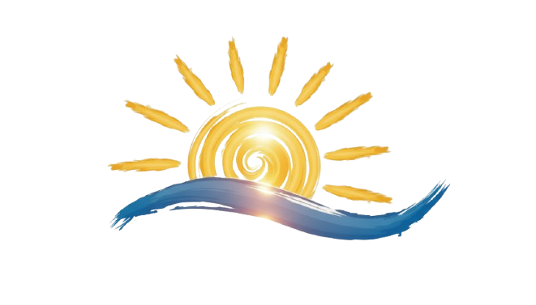

<p align="center">
  
</p>

<h1 align="center">DawnDesk</h1>

<p align="center">
  <strong>The local-first productivity workspace.</strong>
</p>

<p align="center">
  <a href="./LICENSE"></a>
  
  
  
  
</p>

<p align="center">
  <a href="./README.md">README</a>
  |
  <a href="./CODE_OF_CONDUCT.md">Code of conduct</a>
  |
  <a href="./CONTRIBUTING.md">Contributing</a>
  |
  <a href="./LICENSE">MIT license</a>
  |
  <a href="./SECURITY.md">Security</a>
</p>

---

DawnDesk is a desktop productivity workspace for people who want their daily tools in one focused app. It brings together project management, finance, notes, prompt management, photo editing, video editing, workflow building, developer utilities, and settings inside a Tauri-powered local-first shell.

> [!TIP]
> New to the project? Start with the [documentation index](docs/README.md), then read the [feature and sub-app format](docs/FEATURE_AND_SUB_APP_FORMAT.md) before adding a new module.

## Why DawnDesk

- One workspace for planning, writing, editing, automating, and managing work.
- Local-first desktop foundation with Tauri and Rust.
- React and TypeScript frontend built around modular sub-apps.
- Living documentation that gets updated as features evolve.
- Native media support through FFmpeg and FFprobe sidecars.

## Quick Start

```bash
npm install
npm run dev
```

For the desktop app:

```bash
npm run tauri dev
```

For a production build:

```bash
npm run build
npm run tauri build
```

## App Areas

- Dashboard
- Project Manager
- Finance Manager
- Notes
- Prompt Manager
- Photo Editor
- Video Editor
- Workflow Builder
- Developer Tools
- Settings

## Documentation

The documentation is kept in a small set of living files. When a feature changes, update the relevant existing doc instead of creating a new one.

- [Documentation index](docs/README.md)
- [Architecture](docs/ARCHITECTURE.md)
- [Features](docs/FEATURES.md)
- [Development guide](docs/DEVELOPMENT.md)
- [Testing guide](docs/TESTING.md)
- [Asset inventory](docs/ASSETS.md)
- [Documentation maintenance](docs/DOCUMENTATION_GUIDE.md)
- [Feature and sub-app format](docs/FEATURE_AND_SUB_APP_FORMAT.md)

## Tech Stack

- React 19 and TypeScript
- Vite
- Tailwind CSS
- Tauri 2 and Rust
- Supabase for cloud-backed feature areas
- FFmpeg and FFprobe sidecars for video tooling

## Repository Layout

```text
src/                  React app, pages, components, frontend engines
src/assets/           Bundled frontend image assets imported by code
public/               Static public assets referenced by URL
src-tauri/            Tauri desktop shell, Rust commands, sidecars
supabase/migrations/  Database schema migrations
scripts/              Local helper scripts
docs/                 Living project documentation
```

## Project Standards

- Add user-facing capability changes to `docs/FEATURES.md`.
- Add structure, data flow, or native-command changes to `docs/ARCHITECTURE.md`.
- Add setup, commands, troubleshooting, or environment changes to `docs/DEVELOPMENT.md`.
- Add or update test expectations in `docs/TESTING.md`.
- Add new images, videos, icons, and cleanup notes to `docs/ASSETS.md`.
- Follow `docs/FEATURE_AND_SUB_APP_FORMAT.md` when adding a new feature or sub-app.

## Contributing

Read [CONTRIBUTING.md](CONTRIBUTING.md) before opening a pull request. Keep changes focused, update the living docs, and include tests for new behavior whenever practical.
