# Architecture Diagrams

This document shows how each DawnDesk sub-app is wired: where data lives, which dependencies it uses, and how the major flows move through React, browser storage, Supabase, Tauri, Rust, SQLite, and sidecar binaries.

Use this alongside [ARCHITECTURE.md](ARCHITECTURE.md) and [FEATURE_AND_SUB_APP_FORMAT.md](FEATURE_AND_SUB_APP_FORMAT.md). When a sub-app changes storage, routing, native commands, Supabase tables, or file formats, update the diagrams here.

## Global Shell

### Runtime Map

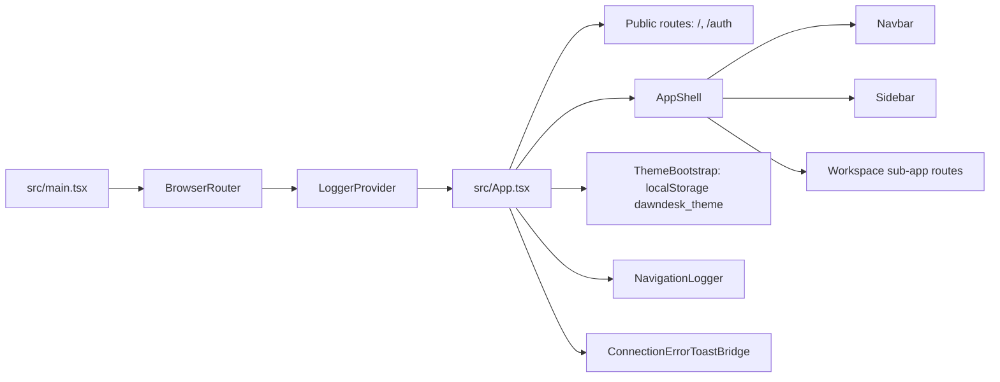

### Shared Storage and Dependency Map

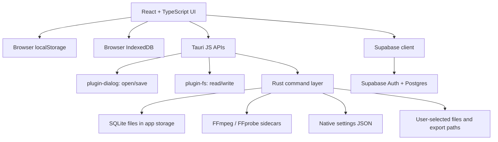

## Dashboard

Dashboard is the workspace overview. It reads summary data from local browser settings, prompt storage, Supabase configuration state, and the app log file.

### Data Flow

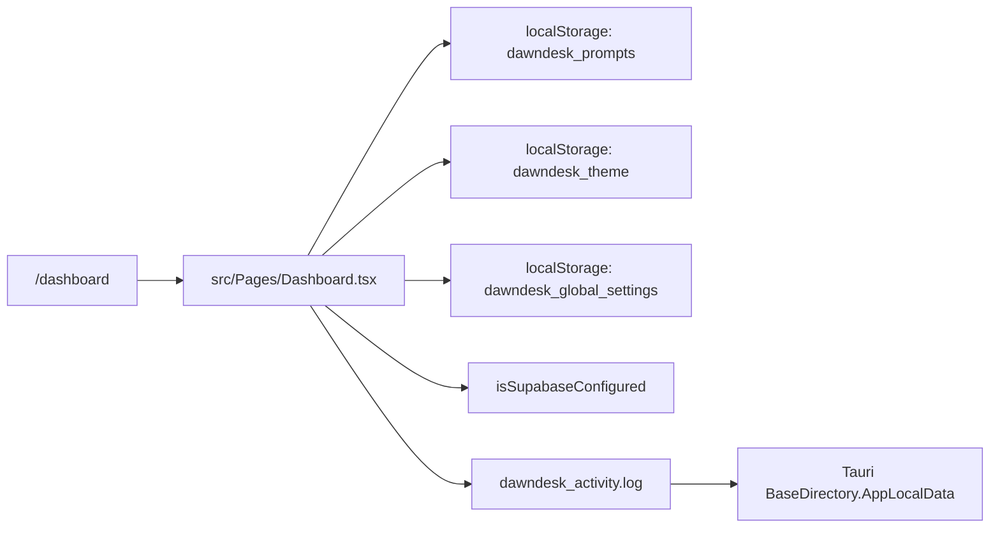

### Dependencies and Storage

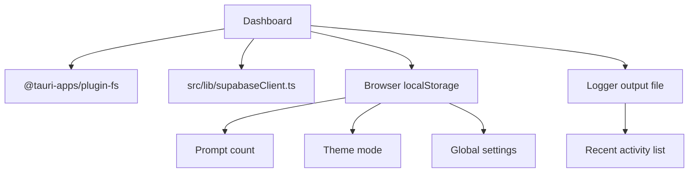

## Project Manager

Project Manager is a Supabase-backed workspace for project planning, issues, comments, members, strategies, backlog, board, roadmap, reports, and settings.

### Data Flow

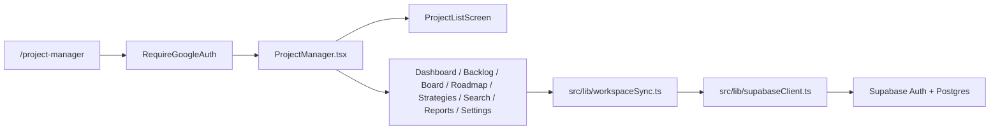

### Supabase Storage Model

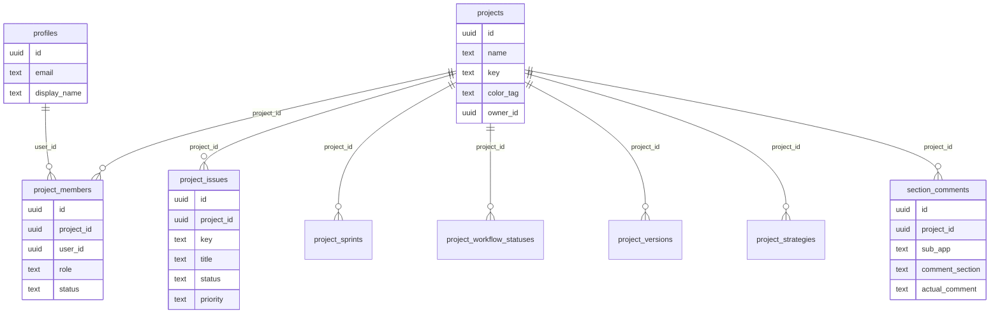

### Dependency Map

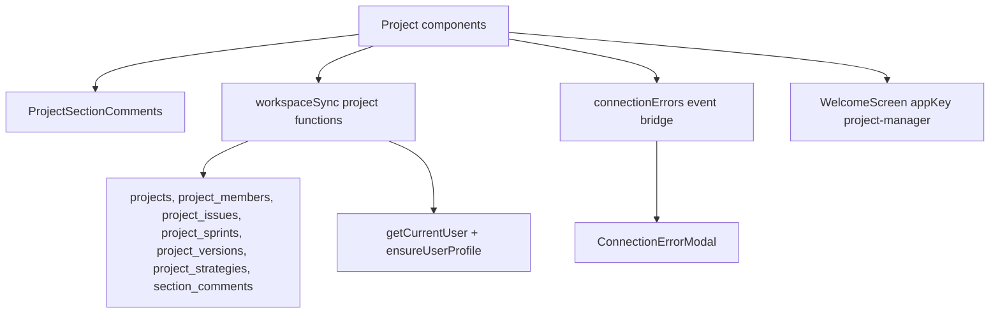

## Finance Manager

Finance Manager is a Supabase-backed finance workspace. It uses a compatibility invoke wrapper so finance views can call command-like operations while data is stored in Supabase tables.

### Data Flow

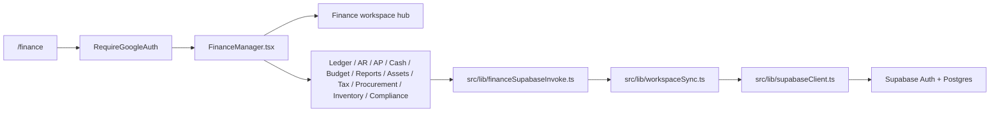

### Supabase Storage Model

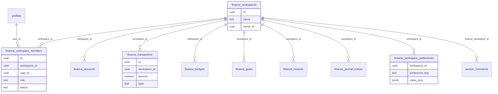

### Command Compatibility Layer

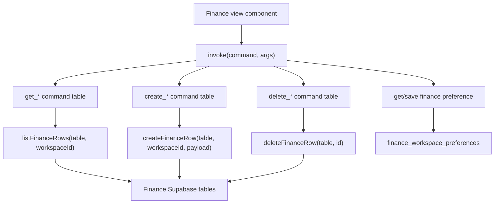

## Notes

Notes is a local native sub-app backed by SQLite through Tauri commands. React invokes Rust commands, and Rust stores notes data under the app storage root.

### Data Flow

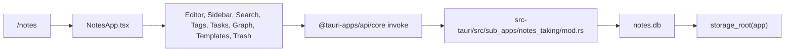

### SQLite Storage Model

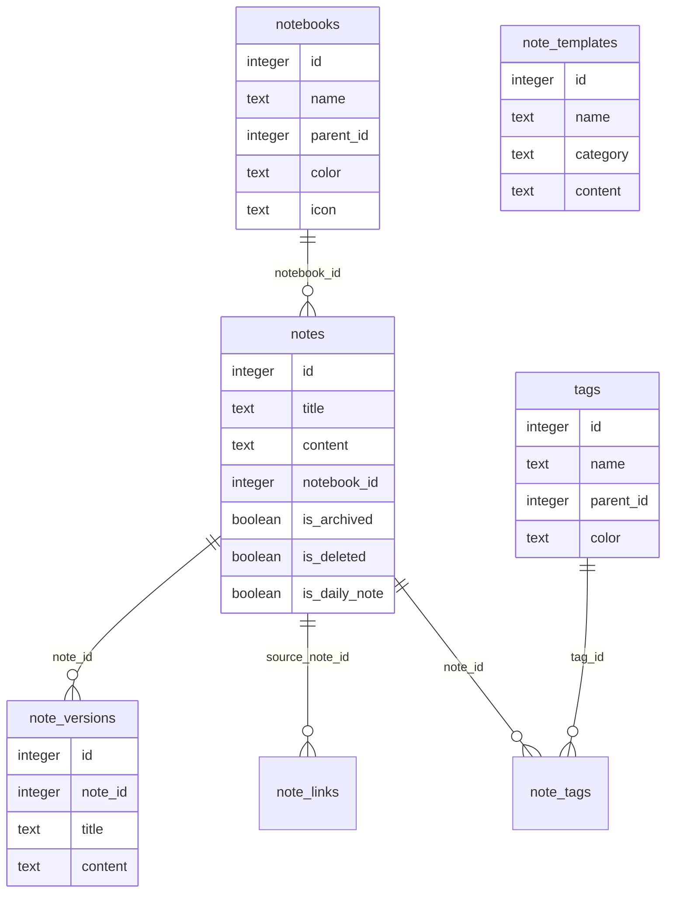

### Command Dependencies

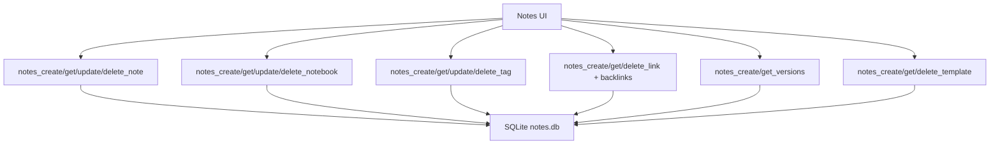

## Prompt Manager

Prompt Manager has two storage paths: local prompt library in browser localStorage, and Prompt Hub data in Supabase.

### Data Flow

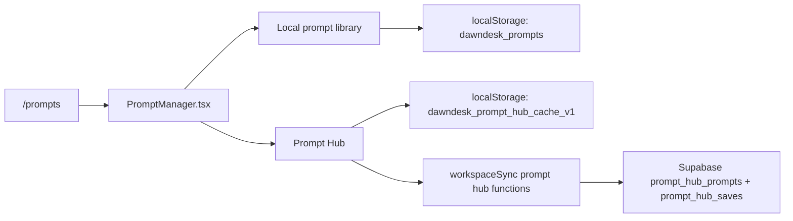

### Supabase and Cache Model

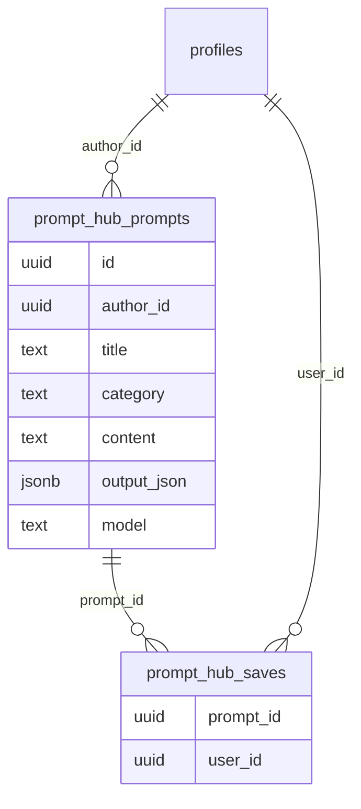

### Dependency Map

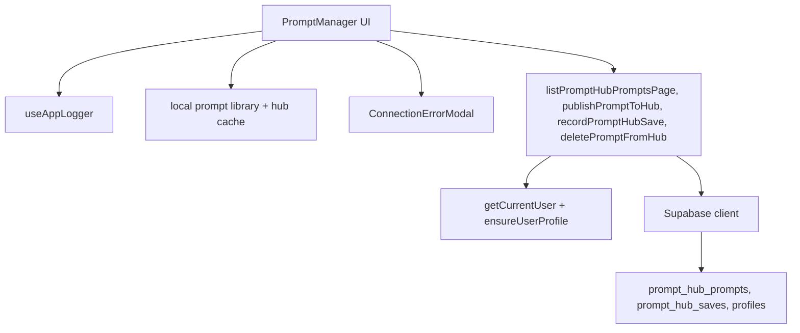

## Photo Editor

Photo Editor is mostly browser-side editor state and canvas work, with IndexedDB project storage and one native export command.

### Data Flow

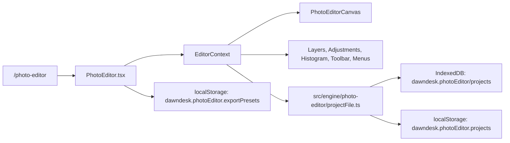

### Project Storage Model

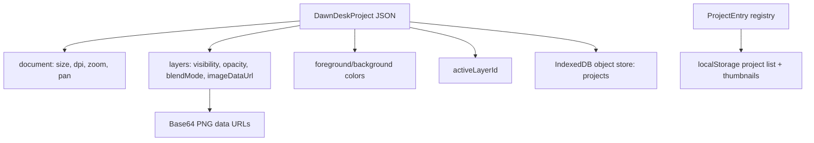

### Native Export Dependency

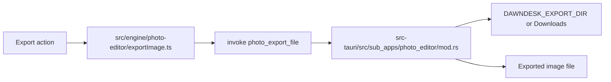

## Video Editor

Video Editor stores active project state in React context, saves `.ddvp` project files through Tauri, and uses FFmpeg/FFprobe sidecars for media probing, thumbnails, waveforms, and rendering.

### Data Flow

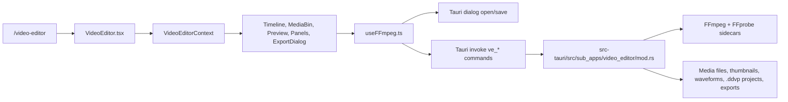

### Native Command Flow

```mermaid
flowchart TB
  useFFmpeg["useFFmpeg"] --> check["ve_check_ffmpeg"]
  useFFmpeg --> probe["ve_probe_media"]
  useFFmpeg --> thumbnail["ve_generate_thumbnail"]
  useFFmpeg --> waveform["ve_generate_waveform"]
  useFFmpeg --> import["ve_import_media"]
  useFFmpeg --> export["ve_export_project"]
  useFFmpeg --> cancel["ve_cancel_export"]
  useFFmpeg --> saveProject["ve_save_project"]
  useFFmpeg --> loadProject["ve_load_project"]

  check --> ffmpeg["FFmpeg sidecar"]
  probe --> ffprobe["FFprobe sidecar"]
  thumbnail --> ffmpeg
  waveform --> ffmpeg
  export --> ffmpeg
  export --> progressEvents["export-progress / export-complete / export-error"]
  saveProject --> ddvp[".ddvp JSON project file"]
  loadProject --> ddvp
```

### Storage and Event Model

```mermaid
flowchart LR
  projectState["Video project in React state"] --> saveDialog["save dialog"]
  saveDialog --> ddvp[".ddvp project file"]
  openDialog["open dialog"] --> mediaPaths["User media paths"]
  mediaPaths --> mediaItems["MediaItem records in React state"]
  mediaItems --> timeline["Timeline clips/tracks"]
  exportSettings["Export settings"] --> renderJob["Render job queue in React state"]
  renderJob --> tauriEvents["Tauri export progress events"]
  tauriEvents --> renderJob
```

## Workflow Builder

Workflow Builder is a browser/local-file sub-app. It stores the current workflow in localStorage and can import/export workflow JSON and output files through Tauri file APIs.

### Data Flow

```mermaid
flowchart LR
  route["/workflow"] --> page["WorkflowBuilder.tsx"]
  page --> graph["Nodes + connections + metadata"]
  graph --> autosave["localStorage current workflow"]
  graph --> clipboard["localStorage dawndesk_workflow_clipboard"]
  page --> fileDialogs["Tauri dialog open/save"]
  fileDialogs --> fsPlugin["Tauri fs readTextFile/writeTextFile"]
  fsPlugin --> workflowFile["Workflow JSON files"]
  fsPlugin --> artifacts["Workflow output/log files"]
```

### Workflow Object Model

```mermaid
classDiagram
  class WorkflowNode {
    id
    title
    description
    kind
    input[]
    output
    position
    value
    status
    breakpoint
    pinned
  }
  class Connection {
    id
    from
    to
    fromPort
  }
  class Metadata {
    name
    updatedAt
    version
  }
  Metadata --> WorkflowNode
  WorkflowNode --> Connection
```

### Dependency Map

```mermaid
flowchart TB
  workflowUi["Workflow Builder UI"] --> localStorage["Browser localStorage"]
  workflowUi --> tauriDialog["@tauri-apps/plugin-dialog"]
  workflowUi --> tauriFs["@tauri-apps/plugin-fs"]
  workflowUi --> devTools["Local tool node definitions"]
  workflowUi --> photoVideo["Output routes to Photo/Video/Dev utilities by node intent"]

  tauriDialog --> chooseInput["Select input file"]
  tauriDialog --> chooseOutput["Choose output path"]
  tauriFs --> readWorkflow["Read workflow JSON"]
  tauriFs --> writeWorkflow["Write workflow JSON/artifacts/logs"]
```

## Developer Tools

Developer Tools is a frontend utility hub. Most tools work in memory in the browser; file-based utilities use browser `File` objects and downloads.

### Data Flow

```mermaid
flowchart LR
  route["/dev-tools"] --> page["DevTools.tsx"]
  page --> hub["DevToolsHub.tsx"]
  hub --> toolState["React component state"]
  hub --> fileReader["Browser FileReader / File text reads"]
  hub --> downloads["Browser downloads"]
  hub --> newWindow["window.open preview output"]
```

### Utility Dependency Map

```mermaid
flowchart TB
  devTools["Developer Tools"] --> textTools["Text, JSON, diff, regex, JWT, URL tools"]
  devTools --> fileTools["File metadata and file text tools"]
  devTools --> generators["Password, UUID, sample data generators"]
  devTools --> downloads["Generated downloadable outputs"]

  textTools --> memory["Browser memory only"]
  fileTools --> browserFile["Browser File API"]
  generators --> memory
  downloads --> anchorDownload["a[download] blob/data URL"]
```

## Settings

Settings combines browser preferences, Supabase session management, and native Tauri commands for OS-level app settings.

### Data Flow

```mermaid
flowchart LR
  route["/settings"] --> page["Settings.tsx"]
  page --> browserPrefs["localStorage dawndesk_theme + dawndesk_global_settings"]
  page --> supabaseAuth["Supabase auth session/signOut"]
  page --> invoke["@tauri-apps/api/core invoke"]
  invoke --> nativeAutoLaunch["get/set_auto_launch"]
  invoke --> nativeGpu["get/set_hardware_acceleration"]
  nativeAutoLaunch --> startupScript["Windows Startup DawnDesk.cmd"]
  nativeGpu --> settingsJson["native-settings.json"]
```

### Preference Storage

```mermaid
flowchart TB
  settingsUi["Settings UI"] --> theme["Theme setting"]
  settingsUi --> globalSettings["Global app settings"]
  settingsUi --> account["Supabase account state"]
  settingsUi --> nativeSettings["Native settings"]

  theme --> themeStorage["localStorage: dawndesk_theme"]
  globalSettings --> globalStorage["localStorage: dawndesk_global_settings"]
  account --> supabaseAuth["Supabase auth"]
  nativeSettings --> appConfig["App config directory"]
  appConfig --> nativeJson["native-settings.json"]
  appConfig --> startup["Windows Startup script"]
```

## Auth and Public Entry Screens

Home and Auth are not sub-apps, but they sit before the workspace and feed Supabase-authenticated areas.

### Entry Flow

```mermaid
flowchart LR
  home["/ Home.tsx"] --> auth["/auth AuthChoice.tsx"]
  auth --> supabaseConfigured["isSupabaseConfigured"]
  supabaseConfigured --> oauth["supabase.auth.signInWithOAuth"]
  oauth --> google["Google OAuth provider"]
  google --> session["Supabase session"]
  session --> protectedRoutes["RequireGoogleAuth protected routes"]
```

### Public Asset Dependencies

```mermaid
flowchart TB
  home["Home"] --> logo["public/realistic_logo.png"]
  home --> video["public/sunflower_field_with_lake.mp4"]
  auth["AuthChoice"] --> logo
  auth --> video
  promptManager["PromptManager avatar/logo area"] --> logo
```

## Update Rules

When a sub-app changes:

1. Update the relevant diagrams in this file.
2. Update [ARCHITECTURE.md](ARCHITECTURE.md) if routes, modules, storage, or native commands changed.
3. Update [FEATURES.md](FEATURES.md) if user-facing behavior changed.
4. Update [ASSETS.md](ASSETS.md) if asset dependencies changed.
5. Update [TESTING.md](TESTING.md) if test coverage or test strategy changed.
