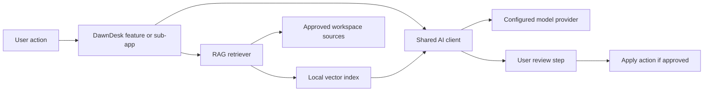
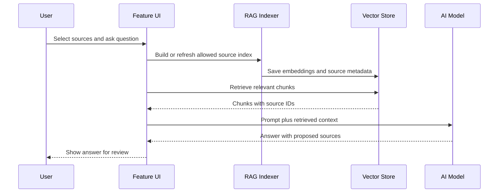

# AI Models and RAG

This document plans DawnDesk AI infrastructure before implementation. It covers provider configuration, model calls, retrieval augmented generation, privacy boundaries, and documentation rules.

## Goals

- Add one shared AI layer instead of separate model code inside every sub-app.
- Support assistant-style chat, document-aware answers, and media-editor assistance.
- Keep API keys outside Git.
- Make user-controlled context sharing the default.
- Make every AI output reviewable before it changes user data or files.

## Planned Architecture

## Provider Configuration

Configuration should live behind one shared AI settings layer.

| Setting | Purpose |
| --- | --- |
| `DAWNDESK_AI_PROVIDER` | Provider name, such as local, OpenAI-compatible, or other supported provider. |
| `DAWNDESK_AI_MODEL` | Main text or multimodal model. |
| `DAWNDESK_EMBEDDING_MODEL` | Embedding model for RAG indexing. |
| `DAWNDESK_AI_API_KEY` | Secret used by the provider. Never commit this. |
| `DAWNDESK_VECTOR_STORE_PATH` | Local vector index path. |

## RAG Sources

Only index sources the user has allowed.

Planned source types:

- DawnDesk notes.
- Project records.
- Prompt templates.
- User-selected local documents.
- DawnDesk documentation.
- App help pages.

Do not index:

- Credentials.
- `.env` files.
- API keys.
- Private files outside user-selected folders.
- Generated media unless explicitly selected.

## RAG Data Flow

## Prompt Rules

- Prompts must state the active sub-app and task.
- Prompts must include only the minimum required context.
- Prompts must ask for structured output when the app needs to apply changes.
- Prompts must separate user text, retrieved context, and system instructions.
- Prompts must not include secrets or hidden local paths unless required and approved.

## Output Rules

AI output should be treated as a proposal.

| Output Type | Required Handling |
| --- | --- |
| Text answer | Show directly with sources when RAG was used. |
| Data update | Show preview before applying. |
| File edit | Show diff, generated asset, or action summary first. |
| Media edit | Keep original media unchanged until the user accepts. |
| Command execution | Require explicit confirmation. |

## Testing Requirements

When implemented, add tests for:

- Missing API key behavior.
- Provider configuration validation.
- Prompt construction without secrets.
- Retrieval filtering.
- Source citation metadata.
- Failure states and retries.
- User approval before write operations.

