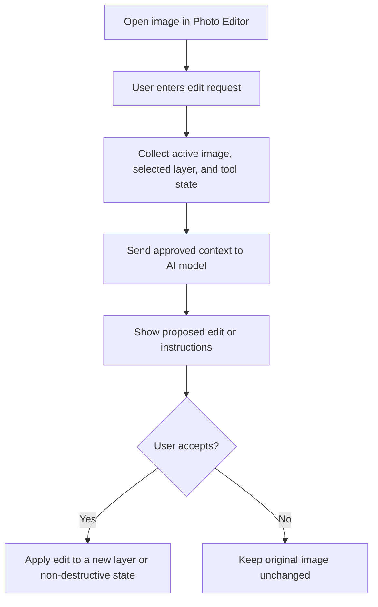

# Photo Editor AI

This document plans AI-assisted Photo Editor features. It is documentation only and does not imply implementation exists yet.

## Status

- Stage: planned
- Target version: `0.5.0`
- Related route: `/photo-editor`
- Related docs: `docs/FEATURES.md`, `docs/ARCHITECTURE.md`, `docs/ARCHITECTURE_DIAGRAMS.md`, `docs/TESTING.md`

## Planned Capabilities

- Natural-language edit requests.
- Background replacement suggestions.
- Object cleanup proposals.
- AI-generated adjustment presets.
- Smart crop and composition suggestions.
- Caption, alt text, and export-name suggestions.
- Layer naming and organization help.

## User Flow

## Context Rules

Allowed context:

- Current image or selected layer when the user requests an AI edit.
- Active tool and adjustment settings.
- User prompt.
- Export target only when needed.

Avoid sending:

- Unrelated project files.
- Workspace notes or project records.
- API keys or local secrets.
- Full filesystem paths unless required for local-only processing.

## Planned AI Actions

| Action | Output | User Review |
| --- | --- | --- |
| Generate adjustment preset | Structured adjustment values | Required before applying |
| Suggest crop | Crop rectangle and explanation | Required before applying |
| Remove object | Preview image or mask | Required before replacing layer |
| Replace background | Preview image | Required before applying |
| Generate alt text | Text | User can edit before saving |

## Storage

AI edit history should be stored with the project file only if the user chooses to keep it.

Planned metadata:

- Prompt text.
- Model provider and model name.
- Timestamp.
- Source layer ID.
- Output layer ID.
- User approval status.

## Testing Plan

- Prompt builder test for selected layer context.
- Missing image state test.
- Missing API key test.
- Preview-before-apply UI test.
- Export metadata test when AI history is saved.
