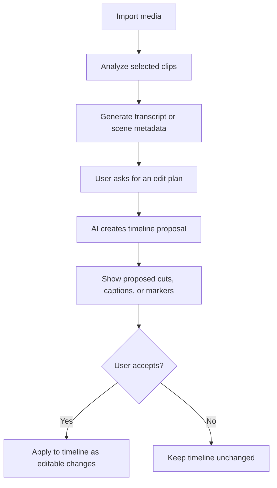

# Video Editor AI

This document plans AI-assisted Video Editor features. It is documentation only and does not imply implementation exists yet.

## Status

- Stage: planned
- Related route: `/video-editor`
- Related docs: `docs/FEATURES.md`, `docs/ARCHITECTURE.md`, `docs/ARCHITECTURE_DIAGRAMS.md`, `docs/TESTING.md`

## Planned Capabilities

- Transcript generation and cleanup.
- Clip summary and scene detection.
- Suggested cuts from a natural-language goal.
- Title, subtitle, and chapter generation.
- B-roll and missing-shot suggestions.
- Export description, tags, and social captions.
- Timeline issue detection, such as silence, black frames, or very loud audio.

## User Flow

## RAG and Media Context

Video Editor AI may use RAG for:

- User-provided scripts.
- Brand guidelines.
- Project notes.
- Previous prompt templates.
- Export platform requirements saved by the user.

Video media should not be indexed permanently unless the user opts in. Prefer storing derived metadata, such as transcript segments and scene timestamps, rather than raw media content.

## Planned AI Actions

| Action | Output | User Review |
| --- | --- | --- |
| Generate transcript | Timed transcript | User can edit before saving |
| Suggest cuts | Timeline edit decision list | Required before applying |
| Create captions | Caption segments | Required before adding to timeline |
| Detect scenes | Markers and summaries | Required before saving markers |
| Generate export copy | Text fields | User can edit before export |

## Storage

Planned metadata:

- Model provider and model name.
- Clip IDs used.
- Transcript segment IDs.
- Timeline changes proposed.
- Timeline changes accepted.
- User prompt and timestamp.

## Testing Plan

- Missing API key test.
- Transcript fixture parsing test.
- Timeline proposal validation test.
- Preview-before-apply UI test.
- Rejection path test to ensure original timeline is unchanged.

