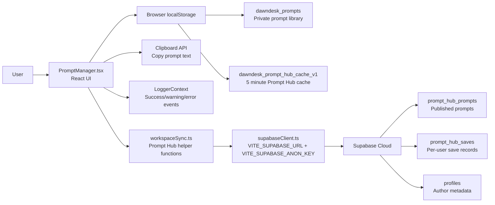
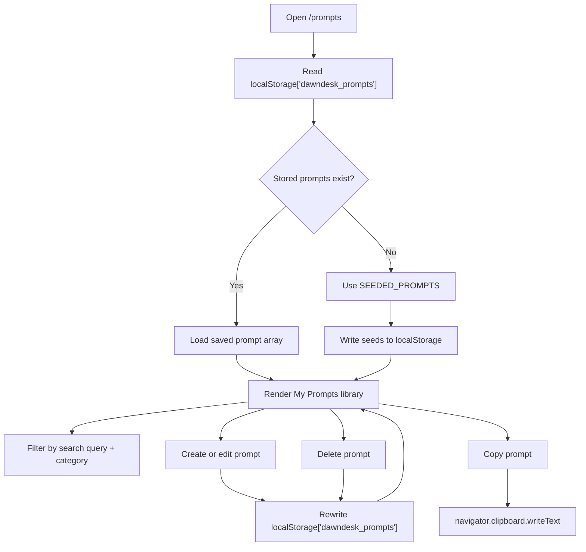
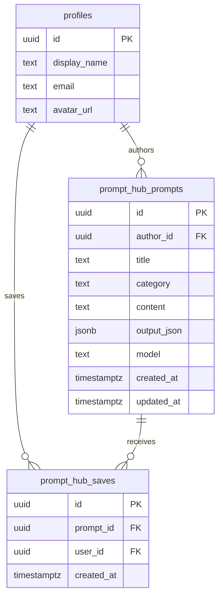
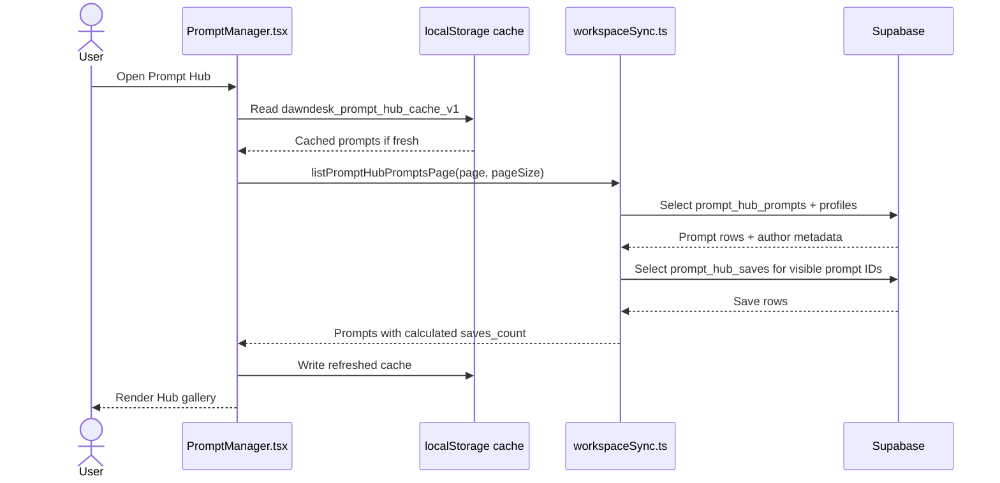
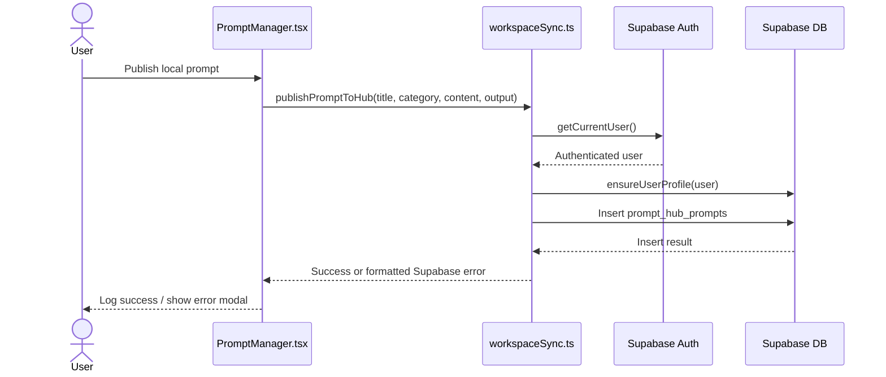
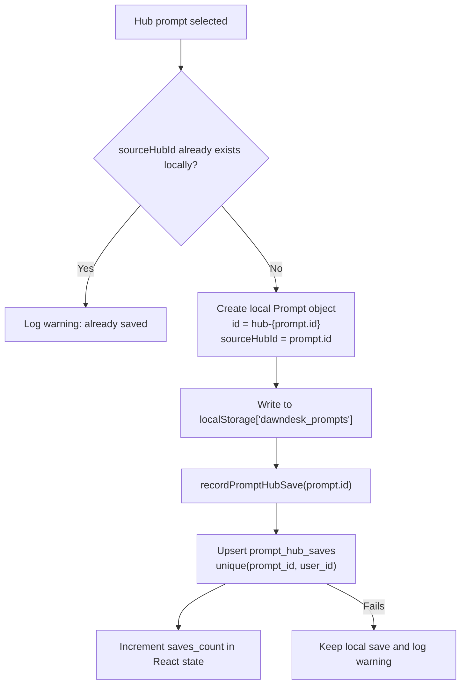
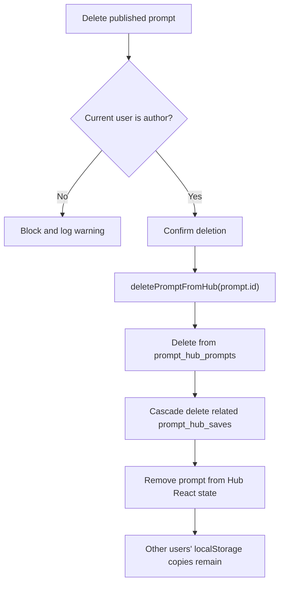

# Prompt Manager Architecture

Prompt Manager is a React-first sub app for storing reusable AI prompt templates locally and optionally sharing selected prompts through a Supabase-backed Prompt Hub. It does not currently have a dedicated Rust/Tauri command module, SQLite tables, FFmpeg pipeline, or local file-processing engine.

## Runtime Entry Points

- Frontend route: `src/App.tsx` maps `/prompts` to `src/Pages/PromptManager.tsx`.
- Main UI module: `src/Pages/PromptManager.tsx`.
- Cloud sync helpers: `src/lib/workspaceSync.ts`.
- Supabase client setup: `src/lib/supabaseClient.ts`.
- Prompt Hub schema: `supabase/migrations/20260531203000_prompt_hub.sql` and `supabase/migrations/20260531214500_prompt_hub_saves.sql`.

## High-Level Architecture



Prompt Manager has two persistence layers:

- Local: private prompts and short-lived Hub cache in browser `localStorage`.
- Cloud: public/shared Prompt Hub data in Supabase.

## Local Architecture

### Purpose

The local section is the user's private prompt library. It works offline and stores prompt templates, categories, reusable variables, and optional model output metadata in browser `localStorage`.

### Data Stored Locally

Local prompt templates are stored under:

```text
localStorage["dawndesk_prompts"]
```

Each local prompt has this shape in `PromptManager.tsx`:

```ts
interface Prompt {
  id: string;
  title: string;
  category: string;
  content: string;
  output?: {
    model: string;
    text: string;
    imageUrl: string;
  };
  authorName?: string;
  sourceHubId?: string;
  isCustom?: boolean;
}
```

The app seeds the local library from `SEEDED_PROMPTS` on first launch. After that, all create, edit, delete, and save-from-hub actions update `dawndesk_prompts`.

Prompt Hub browse results are also cached locally for a short period:

```text
localStorage["dawndesk_prompt_hub_cache_v1"]
```

That cache stores a timestamp and the most recent page of `PromptHubPrompt` objects. It has a 5 minute TTL and is only used to make the Hub feel responsive while fresh Supabase data loads.

### Local Feature Flow



1. On mount, Prompt Manager reads `dawndesk_prompts`.
2. If no saved prompts exist, it writes the seeded prompt list.
3. The UI filters local prompts by category and search query.
4. Creating or editing a prompt writes the full prompt array back to `localStorage`.
5. Copying a prompt uses `navigator.clipboard.writeText`.
6. Deleting a prompt removes it from the local array and rewrites `dawndesk_prompts`.
7. Saving a Hub prompt creates a local prompt with `sourceHubId` and `authorName`, then stores it in `dawndesk_prompts`.

### Local Dependencies

- React state and memoization for filtering, modal state, active view, and form handling.
- Browser `localStorage` for persistent private storage.
- Browser Clipboard API for copy actions.
- App logger from `src/utils/LoggerContext.tsx` for success, warning, and error messages.
- `ConnectionErrorModal` for Supabase connectivity failures.

### Local Non-Goals

- No local database is used for Prompt Manager.
- No Tauri `invoke()` commands are used by the Prompt Manager page.
- No FFmpeg or media-processing runtime is used.
- Image outputs are stored as URL strings only; Prompt Manager does not download, transform, or encode image files.

## Cloud Architecture

### Purpose

The cloud section is Prompt Hub: a public/shared prompt gallery backed by Supabase. Local prompts remain private unless the user explicitly publishes one to the Hub.

### Supabase Configuration

The Supabase client is created in `src/lib/supabaseClient.ts` from Vite environment variables:

```text
VITE_SUPABASE_URL
VITE_SUPABASE_ANON_KEY
```

If either value is missing, `isSupabaseConfigured` is false. Prompt Hub browsing and publishing are blocked, and the UI shows a connection/configuration error.

### Cloud Tables

Prompt Hub uses two Supabase tables.



`prompt_hub_prompts` stores published prompts:

```text
id uuid primary key
author_id uuid references public.profiles(id)
title text
category text
content text
output_json jsonb
model text
created_at timestamptz
updated_at timestamptz
```

`prompt_hub_saves` stores one save marker per user and prompt:

```text
id uuid primary key
prompt_id uuid references public.prompt_hub_prompts(id)
user_id uuid references public.profiles(id)
created_at timestamptz
unique (prompt_id, user_id)
```

The prompt table is indexed by `created_at desc` and `category`. The saves table is indexed by `prompt_id` and `user_id`.

### Cloud Security Model

Both Prompt Hub tables have Row Level Security enabled.

`prompt_hub_prompts` policies:

- Anyone can read published prompts.
- Authenticated users can publish prompts when `auth.uid() = author_id`.
- Authors can update their own prompts.
- Authors can delete their own prompts.

`prompt_hub_saves` policies:

- Anyone can read save records.
- Authenticated users can save prompts when `auth.uid() = user_id`.
- Users can delete their own save records.

### Cloud Feature Flow

#### Browse Prompt Hub



1. `PromptManager.tsx` calls `listPromptHubPromptsPage`.
2. `workspaceSync.ts` queries `prompt_hub_prompts` with author profile data.
3. It then queries `prompt_hub_saves` for the returned prompt IDs.
4. Save counts are calculated client-side from the returned save rows.
5. Results are paginated using `.range(from, to)` with a page size of 24.
6. The UI filters and sorts the loaded Hub prompts in memory.

#### Publish Prompt



1. The user clicks publish from a local prompt.
2. `PromptManager.tsx` calls `publishPromptToHub`.
3. `workspaceSync.ts` requires a Supabase session via `getCurrentUser`.
4. `ensureUserProfile` makes sure the user has a profile row.
5. A row is inserted into `prompt_hub_prompts`.
6. Optional local output metadata is stored in `output_json`; the model is also copied to the `model` column for easier filtering/display.

#### Save Hub Prompt Locally



1. The user saves a Hub prompt.
2. Prompt Manager creates a local prompt in `dawndesk_prompts`.
3. The local prompt includes `sourceHubId` to prevent duplicate saves from the same Hub prompt.
4. `recordPromptHubSave` upserts a row into `prompt_hub_saves`.
5. If cloud save-count recording fails, the local save remains successful and the app logs a warning.

#### Delete Published Prompt



1. Prompt Manager checks that the current Hub profile matches the prompt `author_id`.
2. The user confirms deletion.
3. `deletePromptFromHub` deletes the row from `prompt_hub_prompts`.
4. Supabase cascade behavior removes related `prompt_hub_saves` rows.
5. Local copies already saved by other users remain on their devices because they live in each user's `localStorage`.

## Data Ownership

- Local library: owned by the current desktop/browser profile and stored only in `localStorage`.
- Published prompts: stored in Supabase and associated with the author's profile ID.
- Save counts: stored in Supabase as per-user save records, but duplicated only as a derived display count in React state.
- Hub prompts saved locally: copied into the local library and no longer depend on Supabase availability for normal use.

## Error Handling

Prompt Hub errors are converted into user-facing messages by `getPromptHubErrorMessage` in `PromptManager.tsx`.

Common handled cases:

- Network failures are shown as internet/Supabase reachability errors.
- Missing Supabase environment configuration blocks Hub access.
- Supabase errors are formatted through `formatSupabaseError` in `workspaceSync.ts`.
- Some missing Prompt Hub relations are tolerated in helper functions through `isMissingSupabaseRelation`, allowing the app to avoid crashing if optional Hub tables are not present.

## Current Limitations

- Local prompt data is not synced between devices unless a prompt is explicitly published and re-saved from Prompt Hub.
- Hub search, model filtering, output-type filtering, and sorting run in the frontend over loaded pages, not as server-side full-text search.
- Save counts are calculated by fetching save rows for the current page, not by a database aggregate/view.
- Prompt output images are stored as external image URLs, not uploaded assets.
- There is no import/export file workflow for Prompt Manager yet.
- There is no dedicated Rust module under `src-tauri/src/sub_apps` for Prompt Manager yet.

## Future Architecture Notes

If Prompt Manager grows beyond localStorage, the likely next step is to add a dedicated local persistence layer, either through a Tauri SQLite command module or an IndexedDB-backed frontend store. If Hub usage grows, Prompt Hub should move search, filtering, and save-count aggregation into Supabase RPCs or views so pagination remains accurate under complex filters.
